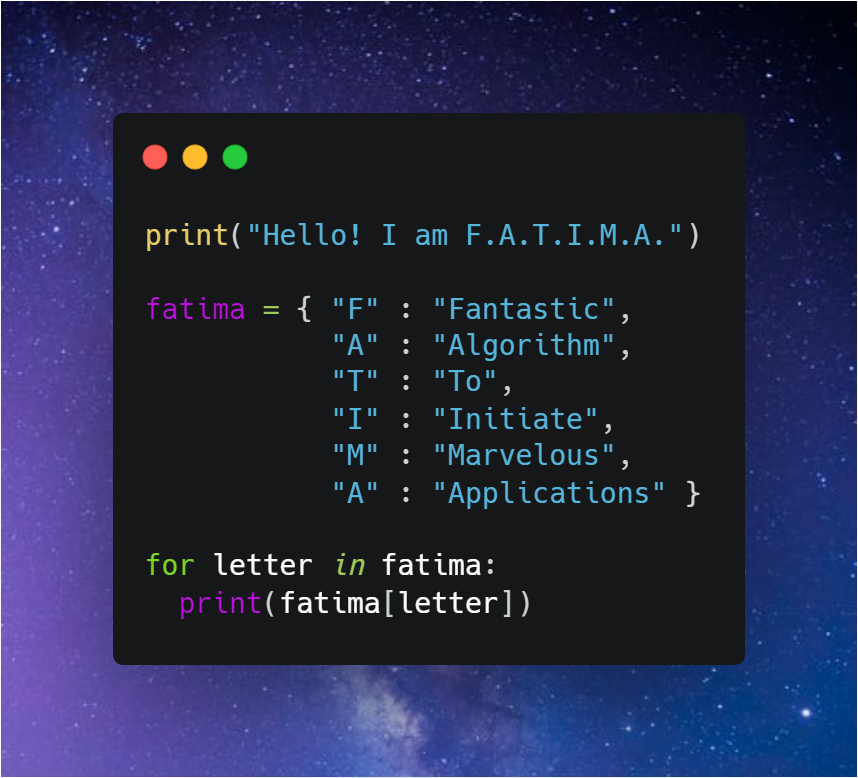

### Hi there 👋 
<!--
### This is Fatima Rizvi!
-->

Welcome to my Github page! My name is Fatima, and I am currently completing the Full Stack Web Development track at Lambda School!  

#### 🌱 Things I am currently working on: 
- Etching glass!  
- Learning and teaching python, algorithms, and data structures 
- Creating a website about notable woman in STEM, feel free to contact me with suggestions!
- Reading [Influence: The Psychology of Persuasion](https://www.amazon.com/Influence-Psychology-Persuasion-Robert-Cialdini/dp/006124189X) by Robert B. Cialdini

#### :computer: Programming languages and tools: 

	

<h3>🛠 Tech Stack</h3>

- ⌨️ Python | Java
- 🌐 JavaScript | React | Redux | HTML | CSS | Bootstrap | Material-UI | Ant Design | Styled-Components
- 🛢 PostgreSQL
- 🌎 Heroku | Vercel | Netlify
- 🔧 Visual Studio Code | IntelliJ IDEA | Git | Postman
- 🖥 Whimsical
- ⚙️ Git | Github | Markdown

